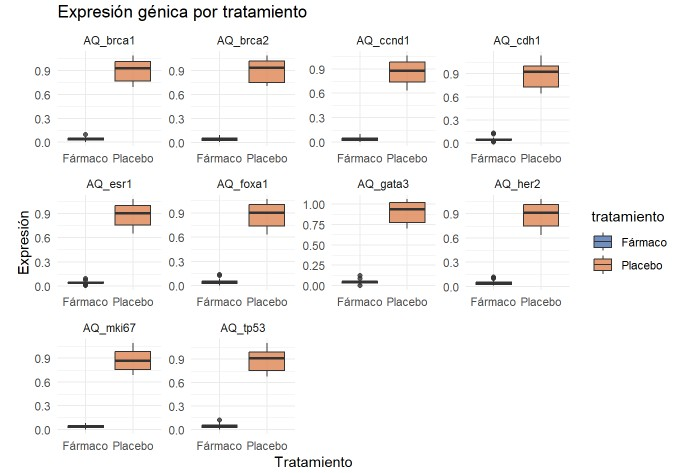
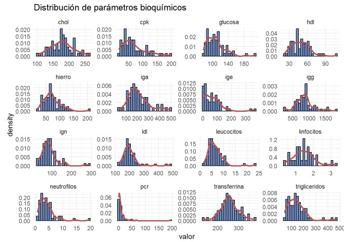
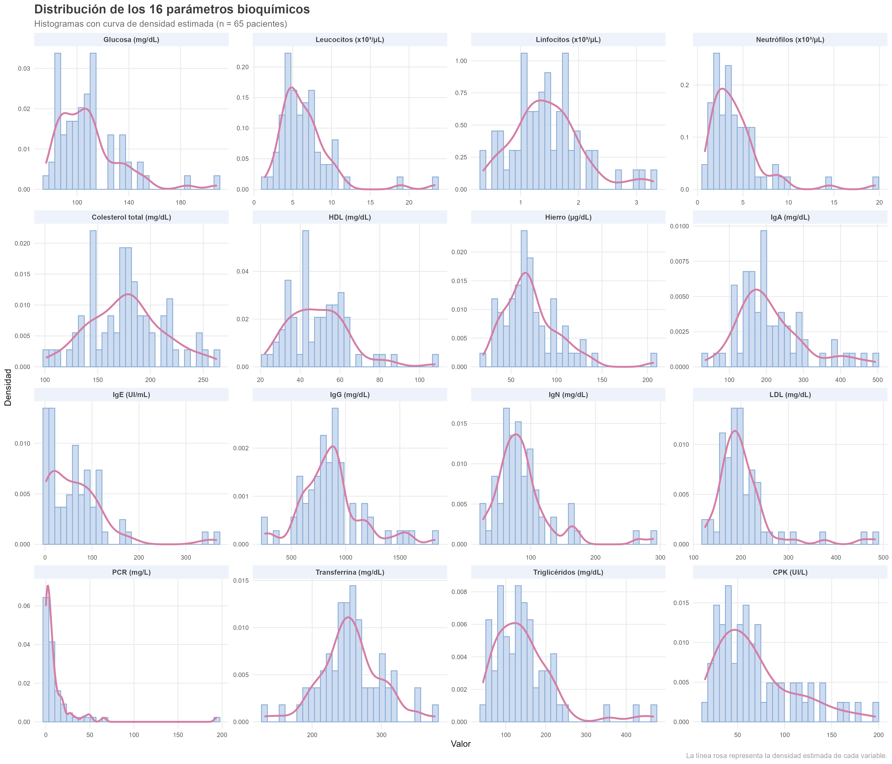
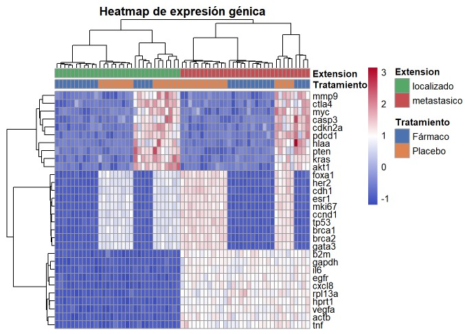

# 🧬 Breast Cancer Data Analysis Using R

<div align="center">


**Exploratory visualization of gene expression and biochemical data in breast cancer patients using R**

</div>

---

## 📋 About this project

This repository contains the code and analysis developed for **Activity 1** of the subject *Statistics and R for Health Sciences*, part of the **Master's Degree in Bioinformatics at UNIR** (Universidad Internacional de La Rioja).

The main objective is to apply biological data visualization techniques to a real clinical dataset of **65 breast cancer patients**, generating publication-quality figures and extracting meaningful biological interpretations.

---

## 🗂️ Dataset

| Feature | Detail |
|---|---|
| **Source** | MUBioinfo dataset (UNIR, October 2025) |
| **Patients** | 65 breast cancer patients |
| **Gene expression variables** | 40 genes measured by qPCR (AQ values = 2^(-ΔCt)) |
| **Treatment groups** | Fármaco (drug) vs. Placebo |
| **Tumor extension** | Localizado (localized) vs. Metastásico (metastatic) |
| **Biochemical parameters** | 16 variables (glucose, lipids, immunoglobulins, inflammatory markers) |

> **Note about AQ values:** AQ (Absolute Quantification) is calculated as 2^(-ΔCt) from qPCR data. It represents the relative expression level of each gene normalized to a reference gene (18S rRNA). A value of 0 indicates undetectable expression under the study conditions.

---

## 📊 Analysis Overview

### Exercise 1 - Gene Expression Box Plots by Treatment

Comparison of the expression distribution of **10 clinically relevant breast cancer genes** between treatment groups (drug vs. placebo) using stratified box plots.

**Genes analyzed:**
`ESR1` · `HER2` · `BRCA1` · `BRCA2` · `MKI67` · `GATA3` · `FOXA1` · `CCND1` · `CDH1` · `TP53`



> **Key findings:** Gene expression distributions are broadly similar between treatment groups, though the placebo group tends to show greater dispersion in several genes. Proliferation-related genes (MKI67, CCND1) and luminal markers (ESR1, GATA3, FOXA1) show modest differences between groups, consistent with the biological heterogeneity expected in a breast cancer cohort. Outliers in TP53, BRCA1, and BRCA2 likely reflect individual molecular profiles rather than a treatment effect.

---

### Exercise 2 - Biochemical Parameter Histograms

Distribution analysis of **16 biochemical variables** across the full patient cohort using histograms with kernel density estimation.

**Parameters:** Glucose · Leukocytes · Lymphocytes · Neutrophils · Cholesterol · HDL · Iron · IgA · IgE · IgG · IgN · LDL · CRP · Transferrin · Triglycerides · CPK




> **Key findings:** Most biochemical variables show **non-normal distributions**. Variables such as CRP (median = 4.8, max = 194.2 mg/L), triglycerides (median = 129, max = 469 mg/dL), and CPK display strong **positive skewness**, with long right tails indicating the presence of patients with markedly elevated inflammatory or metabolic markers. Lipid parameters (cholesterol, HDL, LDL) and transferrin are more symmetrically distributed. IgE shows a highly asymmetric distribution typical of atopic responses. These patterns suggest that **non-parametric statistical tests** and log-transformations would be appropriate for further inferential analyses.

---

### Exercise 3 - Gene Expression Heatmap

Global visualization of all **AQ gene expression variables** across all 65 patients using hierarchical clustering to identify patient subgroups and co-expression patterns.



> **Key findings:** Hierarchical clustering (`cutree_cols = 2`) reveals **two major patient subgroups** with distinct expression profiles. One cluster shows consistently higher expression across multiple genes, while the other shows lower or more heterogeneous values. Patients with metastatic disease show a tendency to concentrate in one of the clusters, though the separation is not complete, reflecting biological complexity. Three gene clusters (`cutree_rows = 3`) are identified: genes with low basal expression, constitutively expressed genes (housekeeping-like), and genes with high inter-patient variability likely driven by individual tumor molecular profiles. This exploratory analysis sets the ground for dimensionality reduction approaches (e.g., PCA, UMAP) in future analyses.

---

## 🛠️ Tools and packages

```r
# Core visualization
library(ggplot2)      # Grammar of graphics
library(patchwork)    # Combining multiple plots
library(pheatmap)     # Heatmaps with hierarchical clustering
library(RColorBrewer) # Color palettes

# Data manipulation
library(dplyr)        # Data wrangling
library(tidyr)        # Data reshaping (pivot_longer)
```

| Package | Version | Purpose |
|---|---|---|
| R | 4.6.0 | Statistical computing environment |
| ggplot2 | 4.0.3 | Box plots and histograms |
| pheatmap | 1.0.13 | Clustered heatmap |
| patchwork | 1.3.2 | Multi-panel figure layout |
| dplyr / tidyr | 1.2.1 / 1.3.2 | Data manipulation |

---

## 📁 Repository structure

```
Breast-Cancer-Data-Analysis-Using-R/
│
├── README.md                                    ← You are here
│
├── analysis/
│   ├── Actividad1_Caren_Moreno.Rmd             ← Full R Markdown source code
│   └── Actividad1_Caren_Moreno.html            ← Rendered HTML report
│
├── data/
│   └── MUBioinfo_dataset_genes_oct2025.csv     ← Dataset (65 patients × 86 variables)
│
└── images/
    ├── Boxplots.png                             ← Exercise 1 figure
    ├── Histograms.png                           ← Exercise 2 figure
    └── Heatmap.png                              ← Exercise 3 figure
```

---

## 🚀 How to reproduce this analysis

1. **Clone this repository**
```bash
git clone https://github.com/CarenMoreno/Breast-Cancer-Data-Analysis-Using-R.git
```

2. **Open the .Rmd file** in RStudio

3. **Install required packages** (if not already installed)
```r
install.packages(c("ggplot2", "dplyr", "tidyr", "patchwork", "pheatmap", "RColorBrewer"))
```

4. **Update the data path** in the loading chunk to match your local path

5. **Knit to HTML** using the Knit button in RStudio

---

## 🔬 Biological context

This analysis focuses on genes with well-established roles in breast cancer biology:

| Gene | Role | Clinical relevance |
|---|---|---|
| **ESR1** | Estrogen receptor | Luminal subtype marker, target for endocrine therapy |
| **HER2** | Receptor tyrosine kinase | HER2-enriched subtype, target for trastuzumab |
| **BRCA1/2** | DNA repair | Hereditary breast cancer risk, PARP inhibitor targets |
| **MKI67** | Proliferation marker | Ki-67, used in tumor grading |
| **TP53** | Tumor suppressor | Most commonly mutated gene in cancer |
| **CCND1** | Cell cycle (Cyclin D1) | Overexpressed in luminal B subtype |
| **CDH1** | Cell adhesion (E-cadherin) | Loss associated with invasive lobular carcinoma |
| **GATA3 / FOXA1** | Transcription factors | Luminal differentiation markers |

---

## 👩‍💻 About me

I am a **Master's student in Bioinformatics at UNIR**, with a strong interest in:

- 🧬 Multi-omics data analysis
- 📊 Statistical visualization of biological data  
- 🎗️ Oncology and precision medicine applications
- 🤖 Machine learning applied to clinical genomics

This repository is part of my growing bioinformatics portfolio. I am actively building skills in R, Python, and bioinformatics pipelines.

📫 **Contact:** [https://www.linkedin.com/in/carenmoreno-biotech/]

---

## 📄 License

This project is shared for educational and portfolio purposes.  
Dataset provided by UNIR as part of the Master's programme coursework.

---

<div align="center">
<i>Last updated: June 2026 · Máster en Bioinformática · UNIR</i>
</div>
